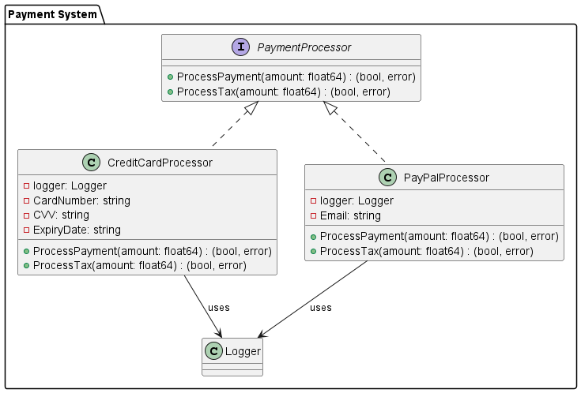

# 2. Что такое интерфейсы, как они применяются в Go?

Интерфейсы в Go используются для решения различных задач в программировании, и их применение можно категоризировать по двум основным направлениям: **Повышение абстракции и унификации кода** и **Гибкость и расширяемость системы**. В рамках этих категорий можно выделить несколько подкатегорий, которые иллюстрируют специфические сценарии использования.

## Базовый пример

Интерфейс `Greeter` имеет один метод `Greet`, который возвращает строку.

```go
type Greeter interface {
    Greet() string
}
```

Этот интерфейс можно реализовать в любом типе, который предоставляет метод `Greet() string`. Вот пример структуры, реализующей этот интерфейс:

```go
type Person struct {
    Name string
}

func (p Person) Greet() string {
    return "Hello, " + p.Name
}
```

Таким образом, любой экземпляр `Person` можно использовать в контекстах, где требуется `Greeter`.
### 1. Повышение абстракции и унификации кода

Эта категория охватывает использование интерфейсов для создания более чистого и управляемого кода, который легче читать, поддерживать и масштабировать.

#### Подкатегории:
1.1 **Инкапсуляция и абстракция**
 
1.1.1 **Скрытие деталей реализации**

**Используя интерфейсы, можно скрыть внутренние детали компонента, предоставляя пользователям только необходимые методы.**
  
Предположим, что мы разрабатываем систему для управления платежами.

В системе могут быть разные способы обработки платежей, например, через кредитные карты, PayPal или банковские переводы. 

Интерфейс `PaymentProcessor` можно использовать для скрытия конкретных деталей каждого метода оплаты, предоставляя только метод `ProcessPayment`, который необходим пользователю.

Вот как может выглядеть интерфейс `PaymentProcessor`:

```go
type PaymentProcessor interface {
    ProcessPayment(amount float64) (bool, error)
}
```

Реализация этого интерфейса для кредитных карт может выглядеть так:

```go
type CreditCardProcessor struct {
    CardNumber string
    CVV        string
    ExpiryDate string
}

func (ccp CreditCardNeed) ProcessPayment(amount float64) (bool, error) {
    // Здесь могла бы быть логика для обработки платежа через кредитную карту
    log.Infoln("Processing credit card payment...")
    return true, nil
}
```


И реализация для PayPal:

```go
type PayPalProcessor struct {
    Email string
}

func (pp PayPalProcessor) ProcessPayment(amount float64) (bool, error) {
    // Здесь могла бы быть логика для обработки платежа через PayPal
    log.Infoln("Processing PayPal payment...")
    return true, nil
}
```

В клиентском коде, который использует `PaymentProcessor`, детали реализации каждого метода оплаты скрыты. Вместо этого клиентский код может вызывать `ProcessPayment` для любого объекта, реализующего интерфейс `PaymentProcessor`:

```go
func executePayment(p PaymentProcessor, amount float64) {
    success, err := p.ProcessPayment(amount)
    if err != nil {
        fmt.Println("Payment failed:", err)
        return
    }
    if success {
        fmt.Println("Payment successful")
    }
}
```

Такой подход позволяет добавлять новые способы оплаты без изменения основного кода, который их использует. Все, что требуется — это новая структура, реализующая интерфейс `PaymentProcessor`.
  


----

1.1.2 **Обеспечение консистентности API**

Интерфейсы помогают в создании стабильного и предсказуемого API для взающихся компонентов системы.

Для демонстрации того, как интерфейс может обеспечивать консистентность API в различных компонентах системы, представим, что у нас есть приложение, которое обрабатывает информацию о пользователях. В этом приложении могут быть разные способы хранения данных пользователя — например, в базе данных или через сторонний сервис. Мы можем определить интерфейс `UserRepository`, который будет предоставлять единообразные методы для взаимодействия с данными пользователя, несмотря на различия в реализации.

Вот как может выглядеть такой интерфейс:

```go
type UserRepository interface {
    Save(user User) error
    FindByID(id string) (User, error)
    Delete(id string) error
}
```

Далее, разные реализации этого интерфейса могут управлять данными пользователя в зависимости от выбранного метода хранения:

### Реализация с использованием базы данных
```go
type DBUserRepository struct {
    db *sql.DB
}

func (repo *DBUserRepository) Save(user User) error {
    // Логика для сохранения пользователя в базе данных
    return nil
}

func (repo *DBUserurl) FindByID(id string) (User, error) {
    // Логика для поиска пользователя по ID в базе данных
    return User{}, nil
}

func (repo *DBUserRepository) Delete(id string) error {
    // Логика для удаления пользователя из базы данных
    return nil
}
```

### Реализация через API стороннего сервиса
```go
type APIUserRepository struct {
    client *http.Client
    apiURL string
}

func (repo *APIUserRepository) Save(user User) error {
    // Логика для сохранения пользователя через API стороннего сервиса
    return nil
}

func (repo *APIUserRepository) FindByID(id string) (User, error) {
    // Логика для поиска пользователя по ID через API стороннего сервиса
    return User{}, nil
}

func (repo *APIUserRepository) Delete(id string) error {
    // Логика для удаления пользователя через API стороннего сервиса
    return nil
}
```

### Использование интерфейса в клиентском коде
Клиентский код, использующий `UserRepository`, может взаимодействовать с любой реализацией интерфейса без знания деталей реализации:

```go
func manageUsers(repo UserRepository) {
    user := User{ID: "123", Name: "John Doe"}
    repo.Save(user)
    repo.FindByID("123")
    repo.Delete("123")
}
```

Этот подход позволяет разрабатывать чистый, модульный и легко тестируемый код. Клиентские компоненты, использующие `UserRepository`, зависят только от абстракции, предоставляемой интерфейсом, что делает API предсказуемым и стабильным вне зависимости от конкретной реализации.

----
1.2 **Управление ресурсами**

1.2.1 **Единообразное закрытие ресурсов**: Использование интерфейса, например `io.Closer`, для унифицированного закрытия файлов, сетевых соединений и других ресурсов.

### 2. Гибкость и расширяемость системы

Использование интерфейсов в этой категории направлено на улучшение адаптивности и расширяемости приложений, что позволяет легко модифицировать и расширять функциональность без значительных изменений в существующем коде.

#### Подкатегории:

- **Полиморфизм**:
    - **Обработка различных типов с одним интерфейсом**: Это позволяет функциям работать с любыми типами данных, которые реализуют определённый интерфейс, облегчая тем самым разработку и поддержку кода.

- **Модульное тестирование и Mocking**:
    - **Тестирование в изоляции**: Интерфейсы позволяют создавать мок-объекты для тестирования компонентов в изоляции от их реальных зависимостей.

- **Стратегическое программирование и паттерны проектирования**:
    - **Адаптер**: Адаптация различных интерфейсов систем для работы друг с другом без изменения их кода.
    - **Стратегия**: Использование интерфейсов для определения семейства алгоритмов, позволяющих взаимозаменять их в зависимости от контекста выполнения.

- **Адаптация к внешним системам**:
    - **Интеграция с внешними API**: Интерфейсы обеспечивают унификацию взаимодействия с разнообразными внешними сервисами и платформами, скрывая различия между их API.

Эти подкатегории показывают, как интерфейсы в Go можно использовать для упрощения разработки и обеспечения архитектурной чистоты и гибкости ваших приложений. Использование интерфейсов таким образом помогает поддерживать код в соответствии с принципами KISS (

Keep It Simple, Stupid) и DRY (Don’t Repeat Yourself), что важно для создания легко поддерживаемого и масштабируемого программного обеспечения.